<picture>
  <source media="(prefers-color-scheme: dark)" srcset="assets/control-plane-dark.svg">
  <source media="(prefers-color-scheme: light)" srcset="assets/control-plane-light.svg">
  
</picture>

[Manifesto](MANIFESTO.md) · [Heurema](https://github.com/heurema) · [Telegram](https://t.me/vitnm)

### Systems

- **[Signum](https://github.com/heurema/signum)** — contract-first proof gate for agentic software changes.
- **[Herald](https://github.com/heurema/herald)** — local-first news intelligence for AI agents.
- **[Arbiter](https://github.com/heurema/arbiter)** — independent AI review for code and decisions.
- **[Punk](https://github.com/heurema/punk)** — experimental kernel for bounded, inspectable AI work.

### Operating doctrine

`bounded scope` · `contracts before execution` · `proof over confidence` · `human-owned outcomes`

> **Automate the work. Never automate the accountability.**
